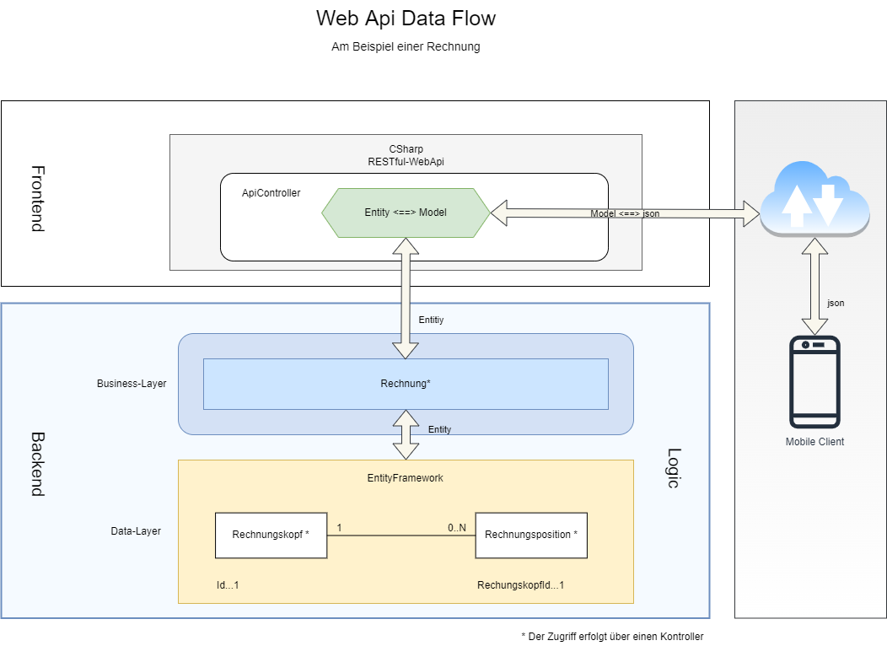

RESTful-Service WebApi
======================

Der ***RESTful-Service*** stellt einen Zugriff außerhalb des Prozessraumes auf den Backend zur Verfügung und bietet somit eine flexible Möglichkeit mit dem Backend zu kommunizieren. So können, zum Beispiel, mobile Endgeräte über das Internet Anfragen an den Backend senden und die entsprechende Antworten auswerten. Neben der flexiblen Kommunikation bietet der ***RESTful-Service*** auch die Möglichkeit, dass das Gesamtsystem leichter skaliert werden kann. Die Verknüpfung der einzelnen Komponenten erfolgt über den Datenaustausch mit unterschiedlichen Formaten. In letzter Zeit hat sich das json-Format als das wichtigste Übertragungsformat etabliert.  

## Funktionsweise

Der ***RESTful-Service*** transformiert die HTTP-Anfragen (GET, POST, PUT, DELETE usw.) sowie deren Daten in Objekte und leitet diese an die entsprechenden Methoden des Backends weiter. Der Backend reagiert auf diese Anfragen und generiert Antwort-Objekte. Diese Objekte werden vom RESTful-Service entgegen genommen und wiederum in einen Datenstrom konvertiert. Dieser Datenstrom wird im Anschluß an den Transformationsprozesses an die Endstelle weitergeleitet. Die nachfolgende Abbildung veranschaulicht den Ablauf schematisch:   

